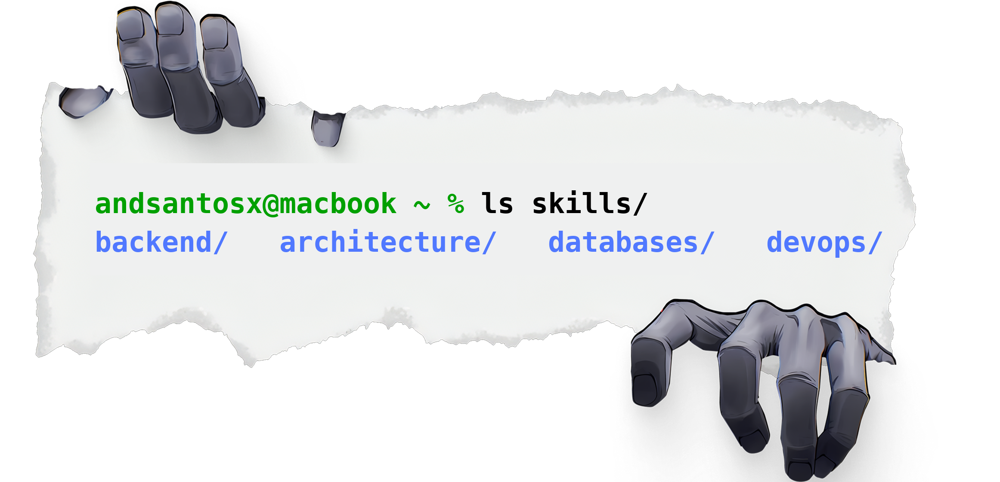

  

  
  
  
  

---

<h2 style="border-bottom: none; padding-bottom: 0;">Sobre mim</h2>

  Entusiasta de <strong>Arquitetura de Software</strong> com foco em construir sistemas práticos, robustos e escaláveis. 
  Gosto de explorar ferramentas e tecnologias modernas, garantindo sempre os melhores padrões de engenharia de software. 
  Atualmente focado em <strong>Clean Architecture</strong>, <strong>Domain-Driven Design (DDD)</strong> e construção de APIs de alta performance.

  <strong>Como penso sobre desenvolvimento:</strong> A qualidade não deve ser um diferencial, mas sim o padrão. 
  Priorizo performance, segurança e excelência técnica desde a concepção do design até o deploy.

 

<h2 style="border-bottom: none; padding-bottom: 0;">Foco no momento</h2>

<ul>
  <li>Projetar aplicações modulares utilizando padrões como <strong>Mappers</strong>, <strong>Services</strong> e <strong>Modules</strong>.</li>
  <li>Construir e integrar APIs escaláveis com <strong>NestJS</strong>, <strong>Python/FastAPI</strong> e <strong>Java</strong>.</li>
  <li>Elevar a qualidade com <strong>Test-Driven Development (TDD/Jest)</strong> e pipelines automatizados (<strong>GitHub Actions</strong>).</li>
  <li>Orquestração e segurança na infraestrutura (<strong>Docker</strong>, <strong>SQL Server</strong>, <strong>PostgreSQL</strong>).</li>
</ul>

 

<h2 style="border-bottom: none; padding-bottom: 0;">Projetos em destaque</h2>

  

  <strong>TypeScript | Express | TypeORM | Zod | Tsyringe</strong> 
  Design voltado para alta escalabilidade e isolamento de domínio utilizando <strong>Clean Architecture</strong> e <strong>SOLID</strong>. O projeto implementa Injeção de Dependências (DI) e validação estrita de schemas para garantir a integridade da camada de regras de negócio.

 

  

  <strong>Python | FastAPI | SQLAlchemy | Alembic | Pytest</strong> 
  Arquitetura focada em concorrência assíncrona (AsyncIO) para maximizar o <em>throughput</em> de requisições web. Utiliza ORM robusto para persistência e suíte de testes de integração ponta a ponta.

 

  

  <strong>Java 17 | Spring Boot 3 | Spring Data JPA | MapStruct | Spring Security</strong> 
  Sistema de gerenciamento de inventário seguindo padrões corporativos (<em>Enterprise Java</em>). Conta com mapeamento de DTOs abstraído, autenticação resiliente e APIs perfeitamente documentadas com OpenAPI/Swagger.

 

<h2 style="border-bottom: none; padding-bottom: 0;">Stack e ferramentas</h2>

  Uso <strong>Java</strong> para sistemas robustos e back-end corporativo, <strong>Python</strong> e <strong>FastAPI</strong> quando o foco é performance assíncrona, e <strong>NestJS</strong> / <strong>Node.js</strong> para serviços escaláveis. 
  <strong>Docker</strong> como base para orquestração, garantindo que o ambiente de produção seja idêntico em qualquer lugar. 
  No banco de dados: <strong>PostgreSQL</strong> ou <strong>SQL Server</strong> — o que importa é modelar bem o domínio e assegurar a integridade.

  
  
  

  
  
  
  
  
  
  
  
  
  
  

  

<h2 style="border-bottom: none; padding-bottom: 0;">Aprendizado e contato</h2>

  Sigo aprimorando minhas habilidades de <strong>Software Architecture</strong> e testando ideias nos repositórios acima. 
  Se algo aqui te parecer útil ou quiser sugerir alguma melhoria, sinta-se à vontade para interagir com o meu código ou mandar uma mensagem no meu <a href="https://www.linkedin.com/in/andsantoss">LinkedIn</a>!

  

